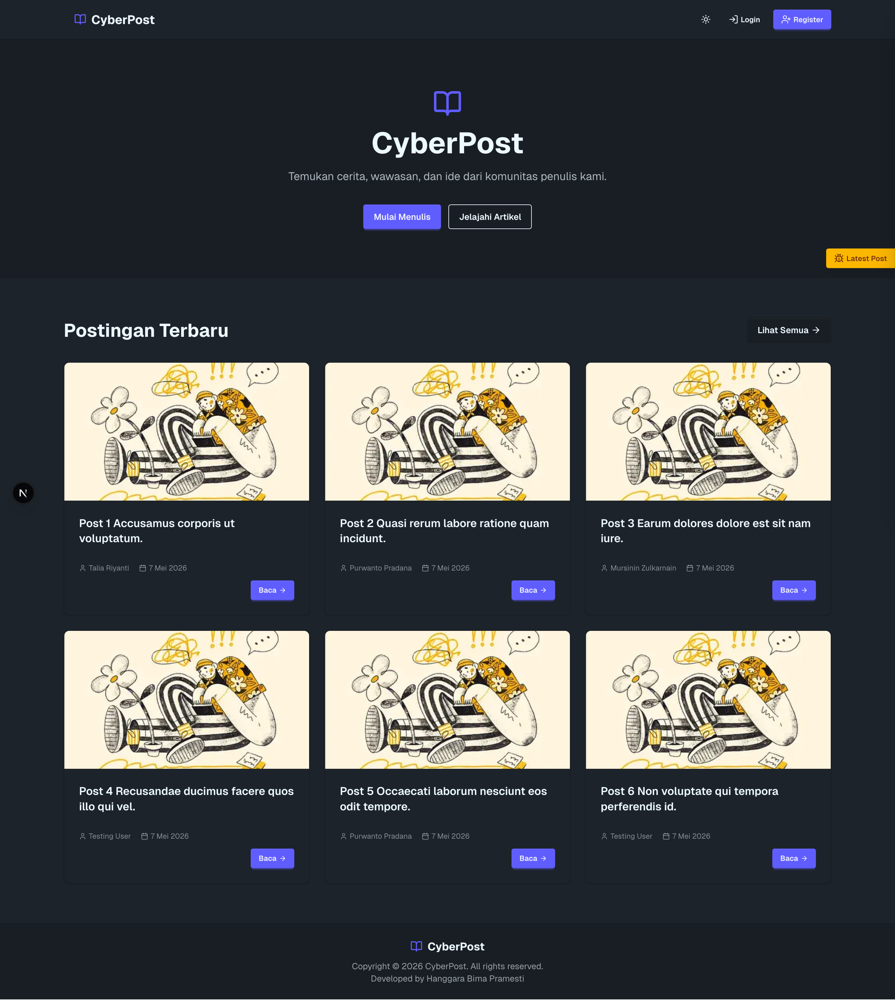
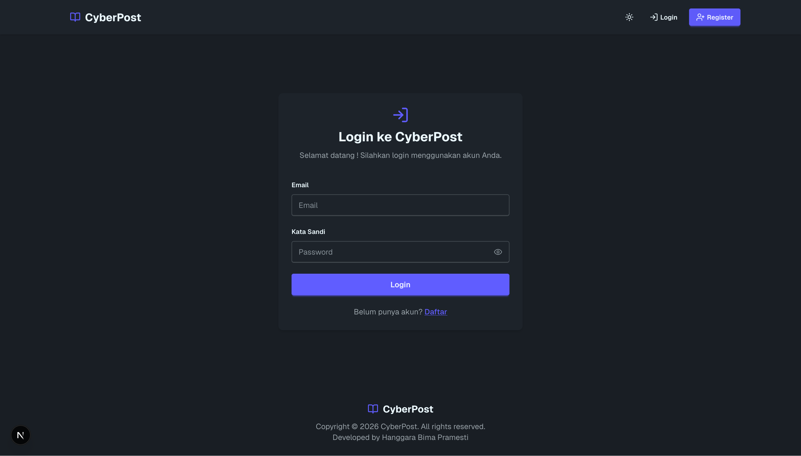
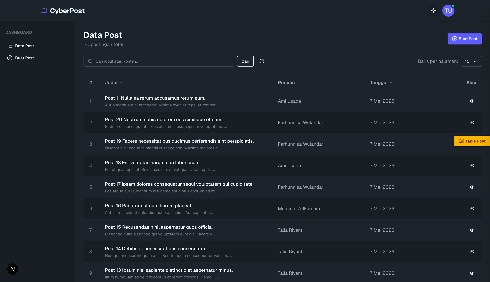

# CyberPost

Aplikasi CRUD fullstack monorepo yang dibangun dengan **Laravel** (REST API) dan **Next.js** (App Router).

## Fitur

- Autentikasi (Register, Login, Logout) via Laravel Sanctum
- Manajemen Post (CRUD)
- Pagination dan filter server side (misal 10 per halaman)
- Otorisasi edit/hapus hanya untuk owner post
- Tema (Dark / Light)

## Tech Stack

| Layer    | Teknologi                                     |
| -------- | --------------------------------------------- |
| Backend  | Laravel 13 (PHP), Sanctum (autentikasi token) |
| Frontend | Next.js 16 App Router, NextAuth v5, Zustand   |
| UI       | DaisyUI v5 + Tailwind CSS v4                  |
| Database | MySQL 8                                       |
| Ikon     | Lucide React                                  |

## Struktur Proyek

```
cyber-post/
├── laravel/          # Backend REST API
├── nextjs/           # Frontend Next.js App
├── docker-compose.yml
└── README.md
```

## Cara Menjalankan

### Dengan Docker (Direkomendasikan)

**1. Clone Repository:**

```bash
git clone https://github.com/durango25/cyber-post
cd cyber-post
```

**2. Siapkan Environment:**

Salin file environment:

```bash
cp laravel/.env.example laravel/.env
cp nextjs/.env.example nextjs/.env.local
```

#### Variabel Environment

Laravel:

- DB_DATABASE=cyberpost
- DB_USERNAME=root
- DB_PASSWORD=root

Next.js:

- NEXT_PUBLIC_API_URL=http://localhost:8000

**3. Jalankan aplikasi:**

```bash
docker-compose up -d --build
```

> Migrasi database, pembuatan app key, dan storage symlink berjalan otomatis saat pertama kali dijalankan.

- Frontend: http://localhost:3000
- Backend API: http://localhost:8000

### Tanpa Docker

Lihat:

- [Panduan Laravel](./laravel/README.md)
- [Panduan Next.js](./nextjs/README.md)

## Endpoint API

### Autentikasi

| Method | Endpoint      | Deskripsi                  |
| ------ | ------------- | -------------------------- |
| POST   | /api/register | Daftar pengguna baru       |
| POST   | /api/login    | Login, mengembalikan token |
| POST   | /api/logout   | Logout (perlu autentikasi) |

### Post (CRUD perlu Bearer token)

| Method | Endpoint        | Deskripsi                         |
| ------ | --------------- | --------------------------------- |
| GET    | /api/posts      | Daftar post (pagination + filter) |
| GET    | /api/posts/{id} | Detail per post                   |
| POST   | /api/posts      | Buat post baru                    |
| PUT    | /api/posts/{id} | Ubah post (hanya owner)           |
| DELETE | /api/posts/{id} | Hapus post (hanya owner)          |

### Public API

| Method | Endpoint                   | Description                                    |
| ------ | -------------------------- | ---------------------------------------------- |
| GET    | /api/public/post-highlight | List highlight post di landing (misal limit 6) |
| GET    | /api/public/posts          | Index semua post                               |
| GET    | /api/public/posts/{slug}   | Detail per post by slug                        |

## Alur Autentikasi

- Pengguna login via NextAuth (Credentials Provider)
- NextAuth memanggil endpoint Laravel `/api/login`
- Laravel mengembalikan API token
- Token disimpan di sesi JWT
- Semua request API yang memerlukan autentikasi menyertakan Bearer token

## Cara Penggunaan

1. Daftar akun baru
2. Login
3. Buat post
4. Edit atau hapus post milik sendiri
5. Tampil post di landing

### Akun Testing (Tanpa Register)

- Email: testing@gmail.com
- Password: Password123-

## Screenshot Aplikasi

### 1. Halaman Landing



### 2. Halaman Login



### 3. Halaman Dashboard


